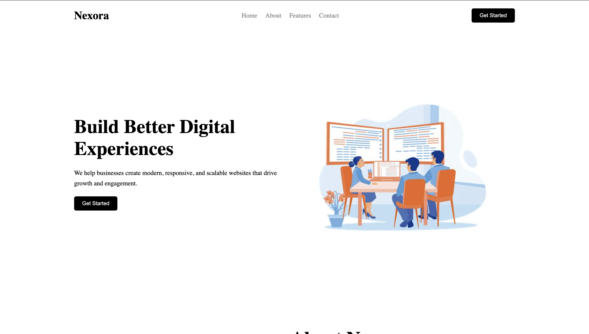
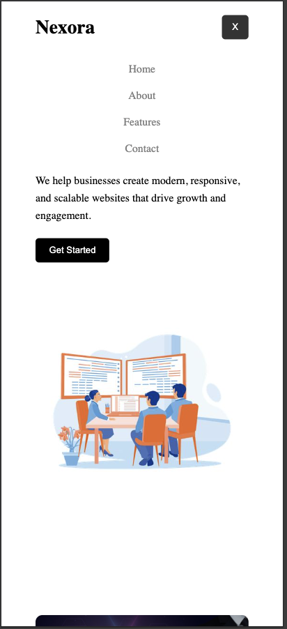

# Nexora - Responsive Landing Page

A modern and responsive landing page built using **HTML, CSS, and JavaScript**.

Nexora is a clean business-style landing page designed with a responsive layout, interactive navigation, smooth scrolling, and client-side form validation.

## 🌐 Live Demo

[View Nexora Live](https://rupeshthapa9700.github.io/nexora-landing-page/)

---

## 🚀 Features

* ✅ Fully responsive design
* ✅ Mobile hamburger navigation menu
* ✅ Smooth scrolling navigation
* ✅ Hero section with modern layout
* ✅ About section with images
* ✅ Feature cards section
* ✅ Contact form validation
* ✅ Interactive buttons and hover effects
* ✅ Clean and modern UI design

---

## 🛠️ Technologies Used

* HTML5
* CSS3
* JavaScript (ES6)

---

## 📂 Project Structure

```text
nexora-landing-page/
│
├── index.html
├── style.css
├── script.js
├── README.md
│
├── images/
│   ├── hero.jpg
│   └── about.jpg
│
└── screenshots/
    ├── desktop.png
    └── mobile.png
```

---

## 💻 Getting Started

### Clone the repository

```bash
git clone https://github.com/rupeshthapa9700/nexora-landing-page.git
```

### Navigate to project folder

```bash
cd nexora-landing-page
```

### Run the project

Open:

```text
index.html
```

in your browser.

No installation or dependencies required.

---

## 📸 Screenshots

### Desktop View



---

### Mobile Responsive View



---

## 📚 What I Learned

While building this project, I practiced:

* Creating responsive layouts using CSS
* Working with Flexbox and media queries
* Building reusable UI sections
* Implementing JavaScript interactions
* Creating mobile navigation menus
* Improving website structure and accessibility

---

## 🌱 Future Improvements

Possible improvements:

* Add dark mode
* Connect contact form with backend/email service
* Add animations using CSS or JavaScript
* Improve SEO optimization
* Add more interactive sections

---

## 👨‍💻 Author

**Rupesh Thapa**

GitHub:
https://github.com/rupeshthapa9700

---

## 📄 License

This project is open-source and available under the MIT License.
